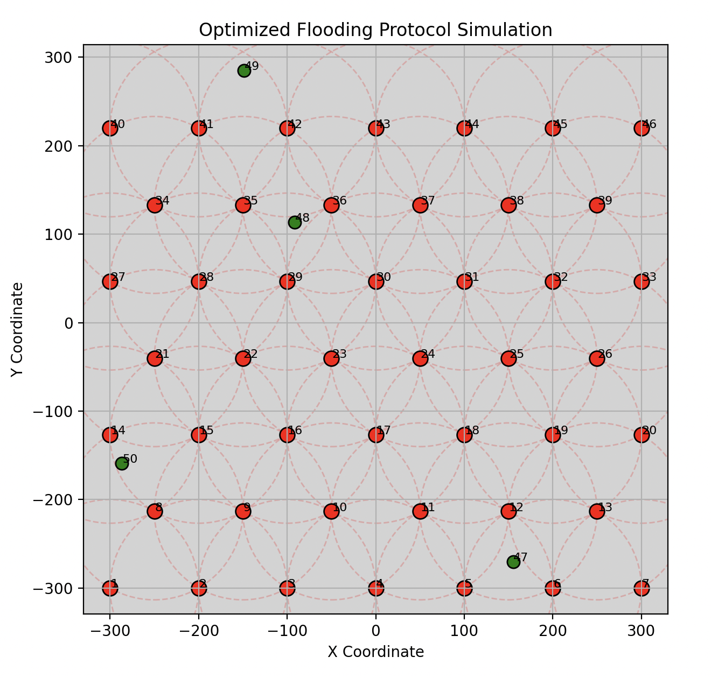
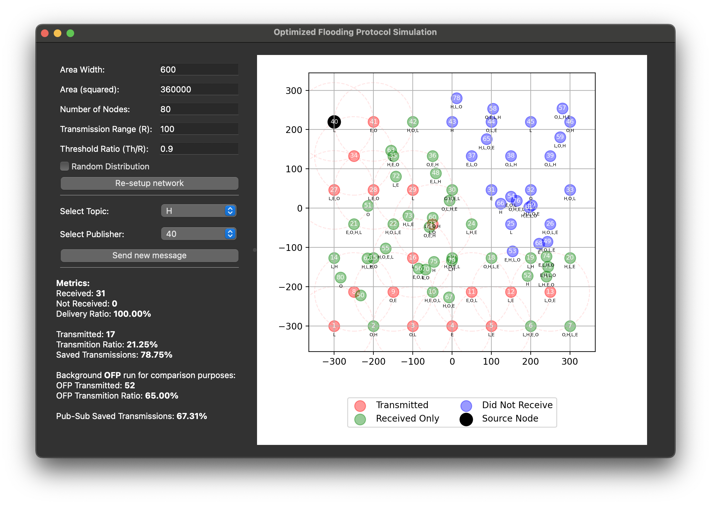

# Optimized Flooding Protocol (OFP) Simulation with Topic-Based Extensions

<p align="center">
  
</p>

A Python simulation of the **Optimized Flooding Protocol (OFP)** for wireless ad-hoc networks, **extended** with a **pub-sub (topic-based) forwarding** mechanism. The core logic is based on the paper [Optimized Flooding Protocol for Ad-hoc Networks](https://arxiv.org/pdf/cs/0311013).

<p align="center">
  
</p>

**This simulation** allows you to adjust network parameters, visualize the node topology, and observe how messages propagate under OFP or topic-based rules—all from an interactive GUI.

## Table of Contents

- [Features](#features)
- [Installation](#installation)
- [Usage](#usage)
- [Parameters](#parameters)
- [Topic-Based Extension \& Metrics](#topic-based-extension--metrics)
- [Visualization](#visualization)
- [Example Output](#example-output)
- [Reference](#reference)
- [Contributing](#contributing)
- [TODO](#todo)
- [License](#license)

---

## Features

- **Optimized Flooding Protocol (OFP)** for wireless ad-hoc networks.
- **Topic-based (Pub-Sub) extension**: Nodes subscribe to specific topics and only forward relevant messages.
- **GUI (PyQt5)** for interactive simulations:
  - Adjust area size, node count, transmission range, threshold, and more.
  - Toggle topic-based forwarding or standard OFP broadcast mode.
- **New metrics**: track topic delivery ratio, percentage of topic-subscribed nodes reached, etc.
- **Minimal overhead**: epsilon adjustment to thresholds to address floating-point precision.

---

## Installation

### Prerequisites

- **Python 3.x**
- **pip** (Python package installer)

### Required Packages

Install the required packages:

```bash
pip install PyQt5 matplotlib
```

---

## Usage

Launch the **GUI** to configure and run simulations:

```bash
python interface.py
```

From the GUI, you can:
- Set **network parameters** (e.g., area width, node count, transmission range, threshold).
- **Enable or disable** topic-based routing (pub-sub).
- Visualize real-time propagation of messages.
- Monitor final statistics (delivery ratio, number of transmissions, topic coverage, etc.).

All configuration details (e.g., topics, threshold ratio, epsilon) are loaded from **`config.py`**, but can be overridden interactively in the interface.

---

## Parameters

**Global parameters** are defined in **`config.py`**, including:
- **`area_width`**: Size of the square simulation area (width × height).
- **`node_count`**: Total number of nodes placed in the network.
- **`transmission_range`**: Wireless range for each node.
- **`threshold_ratio`**: Fraction of `transmission_range` used to determine if a node rebroadcasts.
- **`topics`**: List of string identifiers for the pub-sub approach.
- **`epsilon`**: A small float (e.g., `1e-6`) subtracted from `(threshold_ratio * transmission_range)` to mitigate floating-point inaccuracies.

However, **the GUI** provides a **user-friendly** way to adjust these without modifying code files.

---

## Topic-Based Extension & Metrics

When **pub-sub** is **enabled** in the interface:
- Nodes **only forward** messages if the **topic** is in their subscription or if **neighbors** rely on it.
- **New Metrics** include:
  - **Topic Delivery Ratio**: the percentage of subscribed nodes that actually received the message.
  - **Per-Topic Transmission Count**: how many nodes forwarded messages for a particular topic.

**Implementation Details**:
- **`ofp_simulation.py`**: Core logic, including OFP geometry-based logic and pub-sub constraints.
- Distance threshold & delays remain consistent with the original OFP.

---

## Visualization

The **visualization** (powered by `plot_network.py`) draws the network topology:

- **Red**: Nodes that **transmitted** the message.
- **Green**: Nodes that **received** the message but **did not transmit**.
- **Blue**: Nodes that **did not receive** the message.
- **Black**: The **source node**.
- **Transmission Circles**: Show the active broadcasting range.

In **topic-based** mode, additional color coding or legend entries can reflect topic subscriptions (optional).

---

## Example Output

1. **Network Plot**:
   - Node coloring (red/green/blue/black).
   - Circles for transmission range.
2. **Metrics**:
   - Threshold used (with epsilon).
   - Delivery ratio overall and **per-topic**.
   - Transmission counts or percentage of nodes who saved transmissions.

---

## Reference

- [**Optimized Flooding Protocol for Ad-hoc Networks**](https://arxiv.org/abs/cs/0311013)

---

## Contributing

1. **Fork** this repository
2. **Create a new branch** for your feature or bug fix
3. **Submit a Pull Request** with details of your changes

We welcome **improvements** such as mobility models, multi-topic concurrency, advanced subscription logic, etc.

---

## TODO

- **Mobility**: Introduce node movements (Random Walk or other models).
- **Multi-topic concurrency**: Broadcast multiple topics at once to see interaction effects.
- **Scale up**: Optimize for thousands of nodes and complex topologies.
- **Real-time metrics**: Show graphs as simulation runs, updated continuously in the GUI.

---

## License

[MIT License](./LICENCE)

---

### Additional Note on Epsilon Adjustment

To mitigate floating-point rounding issues, the **actual** threshold is calculated as:  
```
threshold = threshold_ratio * transmission_range - epsilon
```
This ensures nodes near exact boundary distances are properly evaluated for re-broadcast decisions.